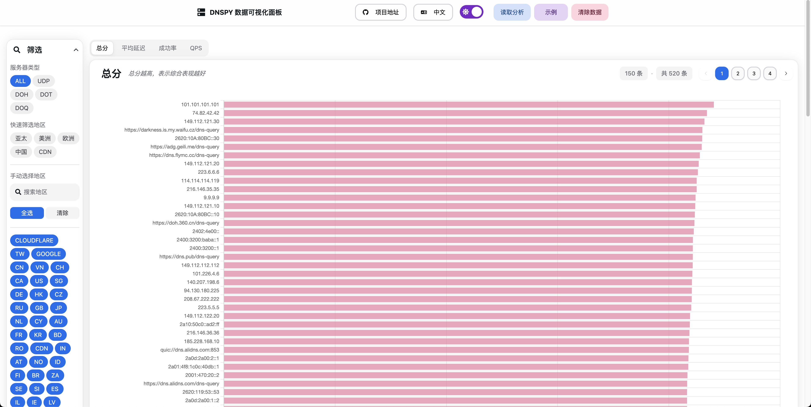

# dnspy - 测试全世界的 DNS 服务器

[English](./README.en.md) | [中文](./README.md)

### 数据分析面板预览



[数据分析面板，内含示例数据](https://bench.dash.2020818.xyz)

## 测试工具

在本仓库的 [releases](https://github.com/xxnuo/dns-benchmark/releases) 页面中按你的系统架构下载 `dnspy-*` 文件，比如我的 PC 是 Intel 处理器的 macOS，所以下载 `dnspy-darwin-amd64` 文件。

然后**必须关闭所有代理软件的 Tun 模式、虚拟网卡模式，否则会影响测试结果。**

重命名文件为 `dnspy`（Windows 是 `dnspy.exe`），然后打开终端，进入到你这个文件所在的目录。执行命令开始测试

```bash
unset http_proxy https_proxy all_proxy HTTP_PROXY HTTPS_PROXY ALL_PROXY
./dnspy
```

按提示输入启动测试

默认使用多线程模式，以加快测试速度。但是默认参数 10 个线程需要至少上下行 1 MB/s 网络和至少 4 核心处理器。
如果网络或处理器不好，会导致测试结果不准确，必须通过`-w` 参数降低线程数。

测试完成后会输出到当前目录下形如 `dnspy_result_2024-11-07-17-32-13.json` 的 JSON 文件中。

按程序提示输入 `Y` 或 `y` 或直接回车，会自动打开数据分析面板网站，点击网站右上角的 `读取分析` 按钮，选择你刚才的 JSON 文件，就可以看到可视化测试结果了。

## 编译测试工具

编译所需环境：

- 你的电脑上需要有 `Go` 环境、`curl` 命令
- 能够访问 Github 下载资源文件

编译过程：

```bash
# 下载本仓库
git clone https://github.com/xxnuo/dns-benchmark.git
cd dns-benchmark/dnspy
# 更新所需数据（需要科学上网）
make update
make
./dnspy
```
